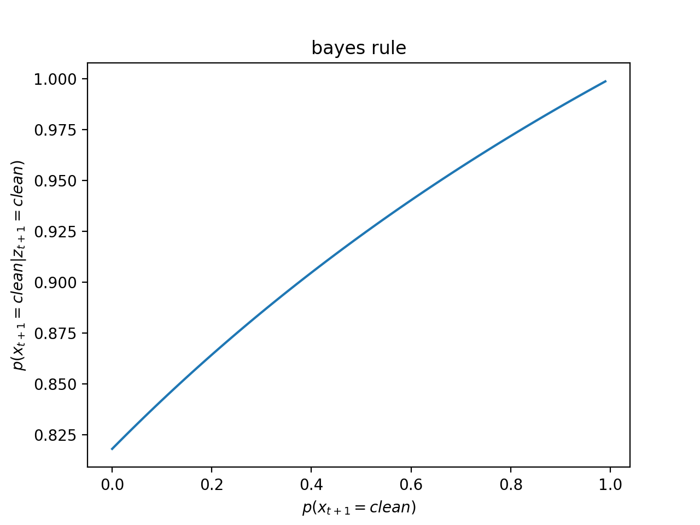
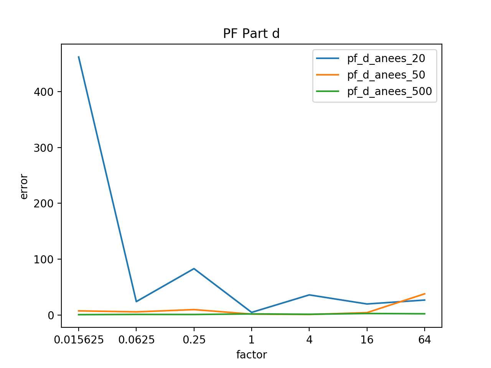

# Homework 1

###1 Bayes Rule (5 points)

Total probability rule:
$$
\begin{align*}
p(x_{t+1}) 
=& \int p(x_{t+1}|x_t)p(x_t)dx_t \\
=& \sum p(x_{t+1}|x_t)p(x_t)\\
=& p(x_{t+1}|x_t=\text{clean})p(x_t=\text{clean}) 
+  p(x_{t+1}|x_t=\text{dirty})p(x_t=\text{dirty})	\\
           
p(x_{t+1}=\text{clean}) 
=& p(x_{t+1} = \text{clean}|x_t=\text{clean})p(x_t=\text{clean}) 
+  p(x_{t+1} = \text{clean}|x_t=\text{dirty})p(x_t=\text{dirty})	\\
=& 1\times c + 0.6 \times (1-c) = 0.4c + 0.6 \\

p(x_{t+1}=\text{dirty}) 
=& p(x_{t+1} = \text{dirty}|x_t=\text{clean})p(x_t=\text{clean}) 
+  p(x_{t+1} = \text{dirty}|x_t=\text{dirty})p(x_t=\text{dirty})	\\
=& 0\times c + 0.4 \times (1-c) = 0.4 - 0.4c \\
\end{align*} \\
$$

Incorpetrating sensor correction:
$$
\begin{align*}
p(x_{t+1}=\text{clean}|z_{t+1}=\text{clean}) 
=& \eta \times p(z_{t+1}=\text{clean}|x_{t+1}=\text{clean}) p(x_{t+1}=\text{clean}) \\
=& \eta \times 0.6 \times (0.4c + 0.6) \\

p(x_{t+1}=\text{dirty}|z_{t+1}=\text{clean}) 
=& \eta \times p(z_{t+1}=\text{clean}|x_{t+1}=\text{dirty}) p(x_{t+1}=\text{dirty}) \\
=& \eta \times 0.2 \times (0.4 - 0.4c) \\
\end{align*}
$$
The normalizer: 
$$
\begin{align*}
&\eta \\
=& [0.6 \times (0.4c + 0.6) + 0.2 \times (0.4 - 0.4c)]^{-1}	\\
=& \frac{1}{0.16c+0.44}
\end{align*}
$$
Final Result:
$$
\begin{align*}
&p(x_{t+1}=\text{clean}|z_{t+1}=\text{clean}) \\
=& \eta \times 0.6 \times (0.4c + 0.6) \\
=& \frac{0.6 \times (0.4c + 0.6)}{0.16c+0.44}   \\
=& \frac{0.24c + 0.36}{0.16c + 0.44}   \\

\end{align*}
$$

###2 Correlated Noise (15 points)

The Kalman filter formulation assumes independent additive Gaussian noise in the transition and observation model.
However, this assumption may not hold in many practical situations.
Consider the following uncontrolled system:
$$
\begin{align*}
  x_0 &\sim \mathcal{N}(\mu_0, \Sigma_0) \\
  x_{t+1} &= A x_t + w_t \\
  w_{t} &= 0.1 w_{t-1} + 0.2 w_{t-2} + p_{t-1} \\
  p_t &\sim \mathcal{N}(0, \Sigma_{pp}) \\
  z_t &= Cx_t + v_t \\
  v_t &= 0.8 v_{t-1} + q_{t-1} \\
  q_t &\sim \mathcal{N}(0, \Sigma_{qq}) \\
  p_{-1} &= q_{-1} = v_{-1} = w_{-1} = w_{-2} = 0
\end{align*}
$$
Describe a new state representation, transition model, and observation model such that the problem can be transformed into the standard uncorrelated noise Kalman filtering setup.

New state representation: $Y_{t+1}​$
$$
\begin{align*}
Y_{t+1} =  
\begin{bmatrix}
   x_{t+1} \\
   w_{t+1} \\
   w_t     \\
   v_t	   
\end{bmatrix} %\tag{4} 公式4
=  
\begin{bmatrix}
   A & I & O & O \\
   O & 0.1I & 0.2I & O \\
   O & I & O & O \\
   O & O & O & 0.8I 
\end{bmatrix}
\begin{bmatrix}
   x_{t} \\
   w_{t} \\
   w_{t-1} \\
   v_{t-1}	   
\end{bmatrix}
+
\begin{bmatrix}
   O \\
   p_t \\
   O  \\
   q_{t-1}
\end{bmatrix} \\\\
\end{align*}
$$
More specifically: 
$$
\begin{align*}
Y_{t+1} =  A' Y_{t} + \epsilon_t, 
A' = 
\begin{bmatrix}
   A & I & O & O \\
   O & 0.1I & 0.2I & O \\
   O & I & O & O \\
   O & O & O & 0.8I
\end{bmatrix},
\epsilon_t = 
\begin{bmatrix}
   O \\
   p_t \\
   O  \\
   q_{t-1}
\end{bmatrix},
\Sigma_{\epsilon\epsilon} =
\begin{bmatrix}
   O & O & O & O \\
   O & \Sigma_{pp} & O & O \\
   O & O & O & O \\
   O & O & O & \Sigma_{qq}
\end{bmatrix}
\\
\end{align*}
$$

For the Sensor Model, we just need to define a new $C'$:

$$
\begin{align*}
Z_{t+1} = C'Y_{t+1} + q_t, \quad 
C' = 
\begin{bmatrix}
   O & O & O & 0.8I 
\end{bmatrix}, \quad
q_t &\sim \mathcal{N}(0, \Sigma_{qq})
\end{align*}
$$
$$
\begin{align*}
Z_{t+1} = 
\begin{bmatrix}
   C & O & O & 0.8I 
\end{bmatrix}
\begin{bmatrix}
   x_{t+1} \\
   w_{t+1} \\
   w_{t} \\
   v_{t}	   
\end{bmatrix}
+ q_t
\\
\end{align*}
$$

###3 Gaussian Conditioning (20 points)

Let's generalize it to high dimension, If we know:
$$
Y = 
\begin{bmatrix}
   Y_1 \\
   Y_2 	   
\end{bmatrix}
\sim \mathcal{N}(\mu, \Sigma),\quad
\mu = 
\begin{bmatrix}
   \mu_1 \\
   \mu_2 	   
\end{bmatrix},
\Sigma =
\begin{bmatrix}
   \Sigma_{11} & \Sigma_{12} \\
   \Sigma_{21} & \Sigma_{22}	   
\end{bmatrix}\\
Y_1 \sim \mathcal{N}(\mu_1, \Sigma_{11}),\quad
Y_2 \sim \mathcal{N}(\mu_2, \Sigma_{22})
$$

Prove that :
$$
Y_1 | Y_2 
\sim \mathcal{N}(\mu_1+\Sigma_{12}\Sigma_{12}^{-1}(Y_2-\mu_2),
				\Sigma_{11}-\Sigma_{12}\Sigma_{22}^{-1}\Sigma_{21})
$$

------
Obviously $Y_1 | Y_2$ is a Mutivariable Gaussian Distribution, so we just need to derive mean and covarience matrix. Preparation: define $Z = Y_1 + AY_2, (A=-\Sigma_{12}\Sigma_{22}^{-1})$

1. Prove that $Z$ and $Y_2​$ are uncorrelated:
$$
\begin{align*}
Cov(Z,Y_2) 
&= Cov(Y_1 + AY_2, Y_2)\\
&= Cov(Y_1 , Y_2) + Cov(AY_2, Y_2) \\
&= \Sigma_{12} + A\Sigma_{22} \\
&= \Sigma_{12} -\Sigma_{12}\Sigma_{22}^{-1}\Sigma_{22} = 0\\
\end{align*}
$$

2. Derive $E(Y_1|Y_2)$: 
$$
\begin{align*}
E(Y_1|Y_2)
&= E(Z - AY_2|Y_2) \\
&= E(Z |Y_2) - E(AY_2|Y_2)\\
&= E(Z) - AY_2 \quad \color{#00F}{\text{notice that:} }Z \bot Y_2,E(AY_2|Y_2)= AY_2\\ 
&= E(Y_1)+E(AY_2) - AY_2 \\ 
&= \mu_1+A\mu_2 - AY_2 \\
&= \mu_1+A(\mu_2 - Y_2) \\
&= \mu_1+\Sigma_{12}\Sigma_{22}^{-1}(Y_2 - \mu_2 ) \\
\end{align*}
$$

3. Derive $Var(Y_1|Y_2)$:
$$
\begin{align*}
Var(Y_1|Y_2)
&= Var(Z - AY_2|Y_2) \\
&= Var(Z|Y_2)+Var(- AY_2|Y_2)+2Cov(Z,-AY|Y_2) \\
&= Var(Z) \\
&= Var(Y_1+AY_2) \\
&= Var(Y_1)+Var(AY_2|Y_2)+2Cov(Y_1,AY_2|Y_2) \\
\color{#00F}{notice} \quad Var(AY_2|Y_2) = 0 \\
&= \Sigma_{11} + A\Sigma_{22}A^T + 2A\Sigma_{21} \\
&= 
\Sigma_{11} 
+ \Sigma_{12}\Sigma_{22}^{-1}\Sigma_{22}(\Sigma_{12}\Sigma_{22}^{-1})^T 
- 2\Sigma_{12}\Sigma_{22}^{-1}\Sigma_{21} \\ 
&= \Sigma_{11} - \Sigma_{12}\Sigma_{22}^{-1}\Sigma_{21} \\ 
\end{align*}
$$

- Conclusion:

$$
Y_1 | Y_2 
\sim \mathcal{N}(\mu_1+\Sigma_{12}\Sigma_{12}^{-1}(Y_2-\mu_2),
				\Sigma_{11}-\Sigma_{12}\Sigma_{22}^{-1}\Sigma_{21})\\
				\Sigma_{12}^{T} = \Sigma_{21}
				
$$

- For here it's just bivariate case:  

So we just need to replace $\Sigma_{11}$ with $\sigma_{11}^2$ , etc. then we can get the result that:
$$
X | Y
\sim \mathcal{N}(\mu_X+\frac{\sigma_{XY}^2}{\sigma_{YY}^{2}}(Y-\mu_Y),
				\sigma_{XX}^2- \frac{\sigma_{XY}^4}{\sigma_{YY}^{2}})
$$

## Landmark-Based Localization

### 4 Linearized Motion Model (10 points)

- Motion Model:

$$
\begin{align}
\begin{bmatrix}
   x' \\
   y' \\
   \theta' 	   
\end{bmatrix}
=
\begin{bmatrix}
   x + \delta_{trans} cos(\theta+\delta_{rot1}) \\
   y + \delta_{trans} sin(\theta+\delta_{rot1})\\
   \theta + \delta_{rot1} + \delta_{rot2}
\end{bmatrix}
\end{align}
$$

1. $G​$ : 
$$
\begin{align}
G
=
\begin{bmatrix}
1 & 0 & -\delta_{trans} sin(\theta+\delta_{rot1}) \\
0 & 1 & \delta_{trans} cos(\theta+\delta_{rot1}) \\
0 & 0 & 1
\end{bmatrix}
\end{align}
$$

2. V :
$$
\begin{align}
V
=
\begin{bmatrix}
-\delta_{trans} sin(\theta+\delta_{rot1}) & 
cos(\theta+\delta_{rot1}) &
0 \\
\delta_{trans} cos(\theta+\delta_{rot1}) & 
sin(\theta+\delta_{rot1}) & 
0 \\
1 & 0 & 1
\end{bmatrix}
\end{align}
$$

### 5 EKF

- ####5.a

  

- ####5.b

  - Because of larger varince, it becomes harder to have a good estimation.

  

- ####5.c

  - the mean doesn't change much, because the data factor is alwayas 1, that's not very noisy.  It's not hard for our model to track the real motion.
  - anees is bad when variance if very low, because anees have a term $\Sigma^{-1}​$, which will be very large when variance is low.

  

### 6 PF

- #### 6.a

  

- #### 6.b

    - Just like 5.b, when the varience become larger, the noise of the real motion is too large to have a good estimation, that's why it shoots up.

    

    

- #### 6.c 

    - when the variance is very low, which means the sensor is too accurate, that's not a good thing. it reduce the diversity.

    

    

    

- #### 6.d 

  - samll num of particles is not a good estimator of real motion

  

  

  
